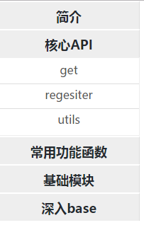

# Accordion 折叠面板

## 开发
1. yarn install
2. yarn start
3. 在编辑器中打开src/components/Accordion中的文件
## 示例图

## Data
```javascript
const data = [{
  title: '简介',
  list: [{
    text: '依赖',
    href: 'http://www.baidu.com'
  }]
}]
```
## Props

<table>
<thead>
<tr>
<th>属性</th>
<th>类型</th>
<th>是否必填</th>
<th>默认值</th>
<th>说明</th>
</tr>
</thead>
<tbody>
<tr>
<td>activeIndex</td>
<td>Number</td>
<td>可选</td>
<td>undefined</td>
<td>指定那个面板激活</td>
</tr>
<tr>
<td>data</td>
<td>Array</td>
<td>必须</td>
<td>为空</td>
<td>面板的数据集合</td>
</tr>
<tr>
<td>fixed</td>
<td>Boolean</td>
<td>可选</td>
<td>false</td>
<td>是否固定折叠面板</td>
</tr>
<tr>
<td>data</td>
<td>Array</td>
<td>必须</td>
<td>为空</td>
<td>面板的数据集合</td>
</tr>
<tr>
<td>onlyOneOpen</td>
<td>Boolean</td>
<td>可选</td>
<td>false</td>
<td>只有一个面板处于展开状态</td>
</tr>
<tr>
<td>width</td>
<td>Number/String</td>
<td>可选</td>
<td>auto</td>
<td>面板宽度</td>
</tr>
</tbody>
</table>
